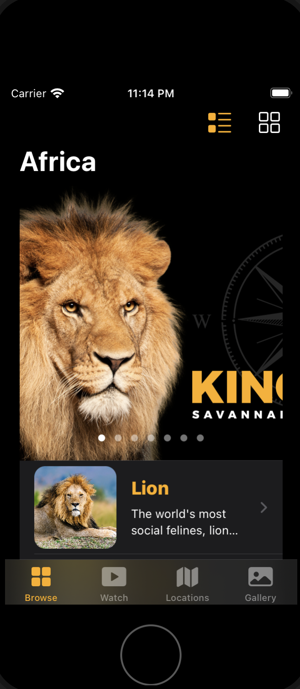
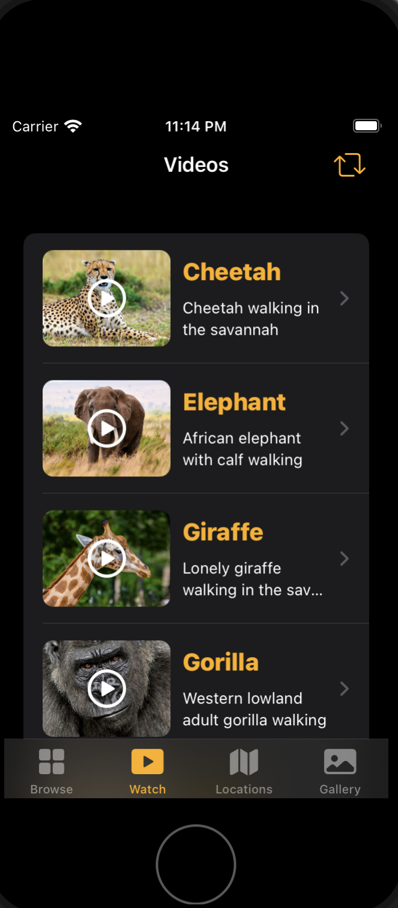
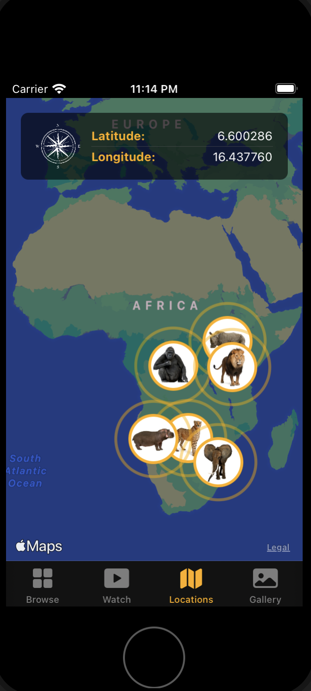
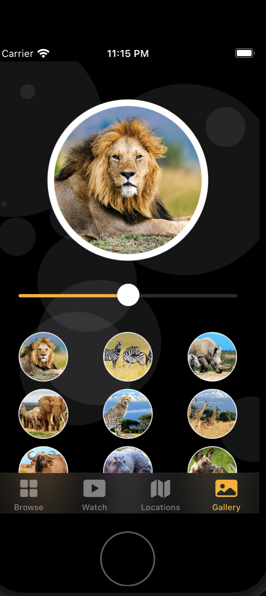

# Africa App 

The Topics Covered : 
JSON with Swift (basic and advanced approach),

Grid Layouts (basic and advanced approach with a cool feature),

MapKit Integration (basic and advanced approach with another cool feature),

Video Player (new SwiftUI 2 feature),

Launch Screen (new way),

Swift programming concept: Extension,

Swift programming concept: Generics,

Prototype the whole application with SwiftUI 2 framework,

Design and improve the User Experience,

iMessage Sticker Pack,

Bring the full iPadOS app to macOS 11 Big Sur using Mac Catalyst technology,

Learn what is Pseudocode and why it is important,

What is a Bundle and Extension in app development and how to use them, etc.

## Authors

- [@Enjy12345](https://github.com/Enjy12345)

## 🚀 About Me
I'm a IOS Developer ...

## Screenshots

## 🔗 Links

## 🛠 Skills
Swift , Swift UI and Firebase.

